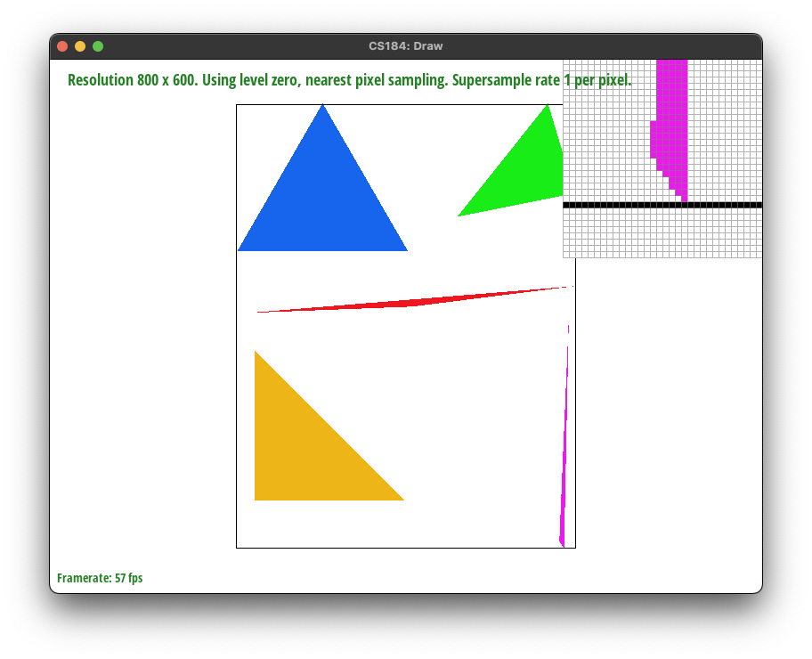
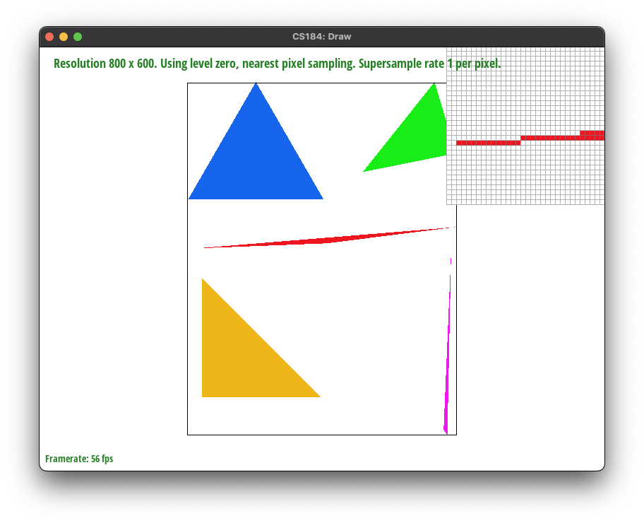
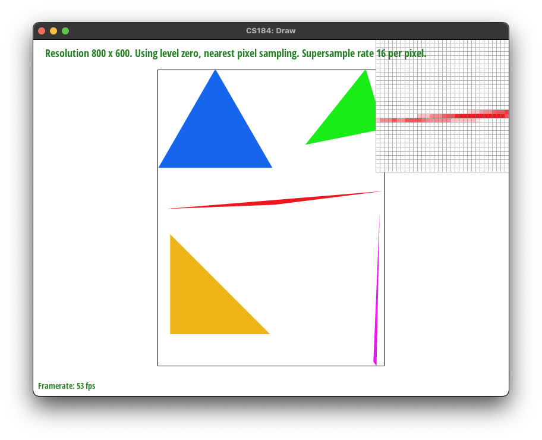
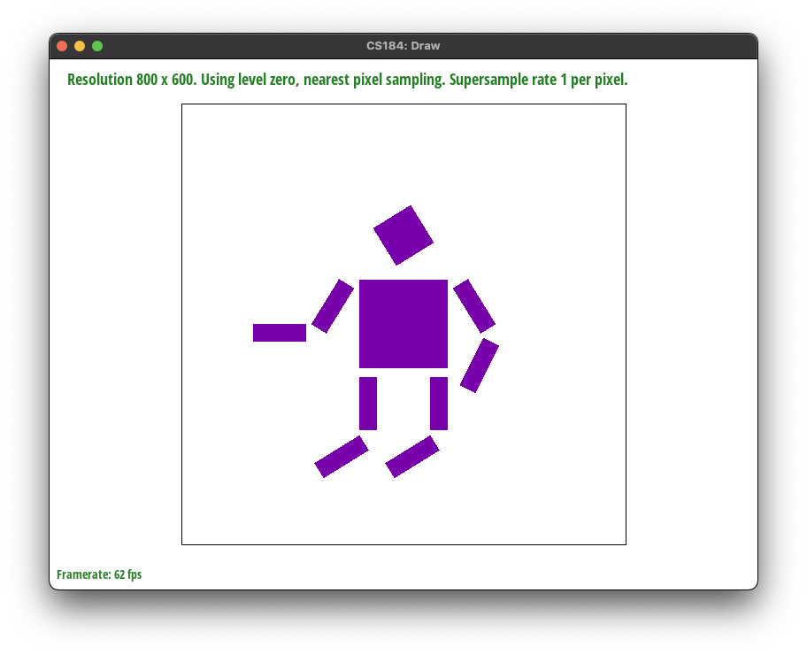
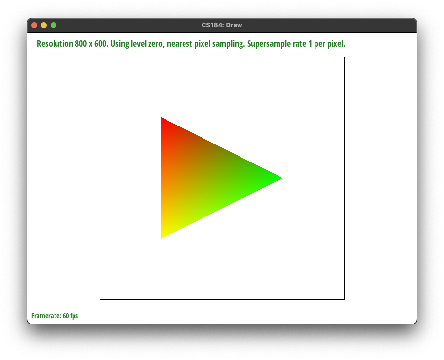
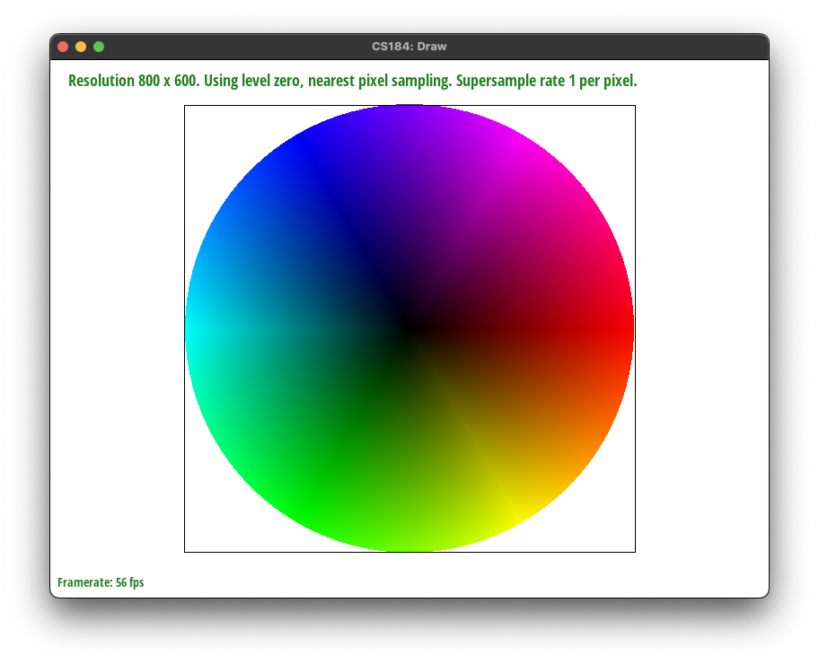
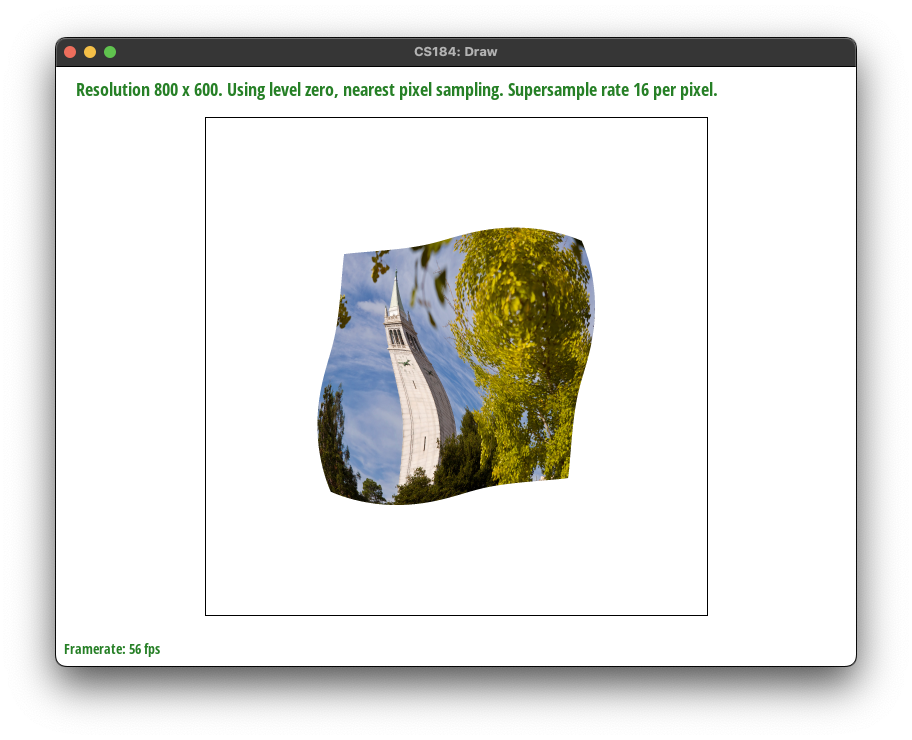
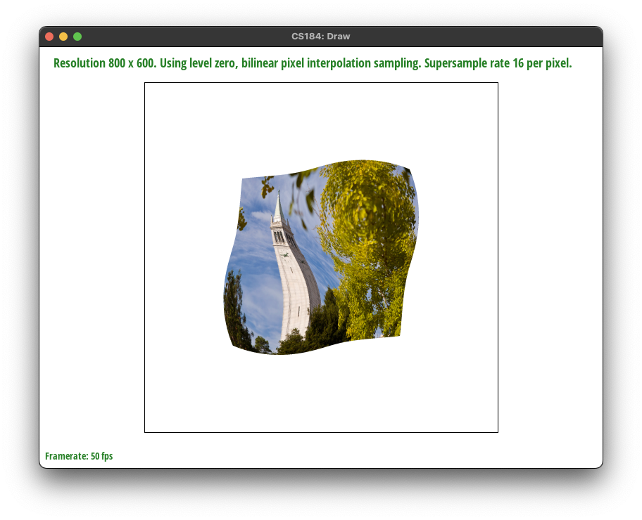
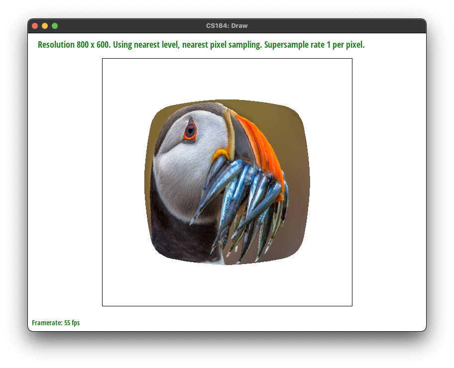
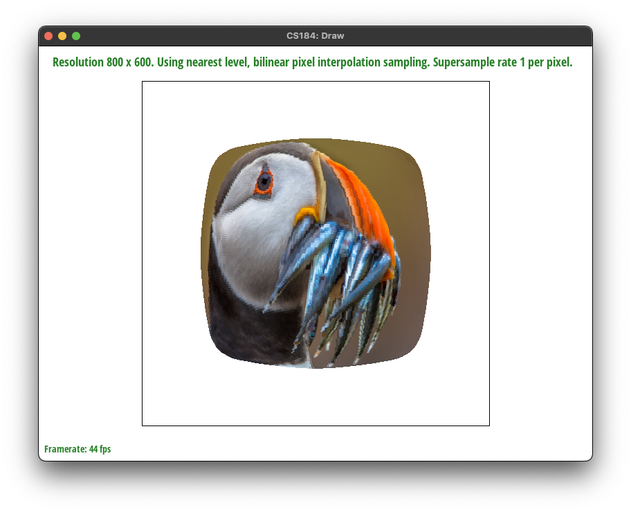

> CS 184/284A: Computer Graphics and Imaging, Spring 2024

> Kian Sutarwala

# Homework 1: Rasterizer
## Overview

In this homework I implemented a rasterizer which takes in vector images and draws pixels to the screen. This task felt really daunting at first but I really enjoyed seeing it all come together and playing with the different antialiasing settings that I had implemented. A major struggle in the homework was dealing with C/C++ number types and properly converting between them and I learned how one minor change in syntax can make or break everything. It really helped solidify my understanding of how barycentric and uv coordinates work too since I had to implemement the logic to convert between the coordinate systems.

## Section I: Rasterization

### Part 1: Rasterizing single-color triangles

* Walk through how you rasterize triangles in your own words.

In order to rasterize triangles, for each pixel in the image grid you check if the center of it is within the bounds of the triangle vertices. This check is done by evaluating the midpoint of the pixel using the three line test. If it is, you draw the entire pixel as the triangle color, otherwise you leave it blank.

* Explain how your algorithm is no worse than one that checks each sample within the bounding box of the triangle.

The algorithm searches the three vertices of the triangle for the smallest and largest x and y points overall to calculate the bounding box of the triangle. Then it iterates over every coordinate in the area and evaluates whether it is contained in the triangle or not. This way it avoids checking pixels that wouldn't even have the possibility of being inside the triangle, saving on wasted cycles.

* Show a png screenshot of basic/test4.svg with the default viewing parameters and with the pixel inspector centered on an interesting part of the scene.

### Part 2: Antialiasing triangles
* Walk through your supersampling algorithm and data structures. Why is supersampling useful? What modifications did you make to the rasterization pipeline in the process? Explain how you used supersampling to antialias your triangles.

Supersampling allows us to increase the fidelity by sampling each pixel multiple times instead of once in the center. This allows for smoother appearing edges especially, reducing the number of jaggies on our rendered images. To modify the rasterization pipeline to support supersampling, I first started by updating the `rasterize_triangle` function. I calculated how many samples would need to be taken in each pixel (`sqrt(sample_rate)`) used that to create a "sample delta" which permutes across both the x and y axis, collecting all of the samples for each pixel. After checking if that sample is inside the triangle it writes the color to that coordinate in the framebuffer. In the beginning of the pipeline we treat the image as scaled by the sampling rate, so if the original image was 1000x1000 and we supersample with a rate of 4 our sample buffer would hold 4000x4000 worth of pixels. I also modified the `set_sample_rate` and `set_framebuffer_target` functions to resize the sample buffer appropriately. The last step is to update the `resolve_to_framebuffer` function to account for the larger sample buffer and average the samples down to write to the framebuffer. I iterate over each pixel in the final framebuffer and collect each of the samples cooresponding to the pixel and average their colors together before committing it to the framebuffer.

* Show png screenshots of basic/test4.svg with the default viewing parameters and sample rates 1, 4, and 16 to compare them side-by-side. Position the pixel inspector over an area that showcases the effect dramatically; for example, a very skinny triangle corner. Explain why these results are observed.

1 sample/pixel | 4 samples/pixel | 16 samples/pixel
:---:|:---:|:---:
 |  | 

When supersampling is disabled, the jaggies on the thin portion of the red triangle become very pronounced, and even at a distance pixelation can be observed which makes it appear much less convincing. However, as soon as we apply even 4x supersampling the edge smooths out as we can see the translucent pixels which support the solid red pixels in defining the triangle shape. With 16x supersampling the results become even more pronounced and a better looking output.

### Part 3: Transforms
* Create an updated version of svg/transforms/robot.svg with cubeman doing something more interesting, like waving or running. Feel free to change his colors or proportions to suit your creativity. Save your svg file as my_robot.svg in your docs/ directory and show a png screenshot of your rendered drawing in your write-up. Explain what you were trying to do with cubeman in words.

The cubeman is purple and flying through the air.

## Section II: Sampling

### Part 4: Barycentric coordinates

* Explain barycentric coordinates in your own words and use an image to aid you in your explanation. One idea is to use a svg file that plots a single triangle with one red, one green, and one blue vertex, which should produce a smoothly blended color triangle.

Barycentric coordinates are a relative coordinate system that allow us to find a point inside a triangle based on its distance from each vertex. We express the coordinate in terms of alpha, beta, and gamma, which are the weights associated with the first, second, and third vertex, respectively. It allows us to map (x, y) coordinates to textures, as well as sample colors so we can get a smooth gradient in shapes with multiple colors, such as the one shown below.

* Show a png screenshot of svg/basic/test7.svg with default viewing parameters and sample rate 1. If you make any additional images with color gradients, include them.

### Part 5: "Pixel sampling" for texture mapping

* Explain pixel sampling in your own words and describe how you implemented it to perform texture mapping. Briefly discuss the two different pixel sampling methods, nearest and bilinear.

Pixel sampling is the process of coloring a pixel based on a provided texture to result in a shape that can display arbitrary images. To achieve this, we can reuse the barycentric coordinates from the previous part but this time use them to translate the (x, y) coordinate of the pixel to a (u, v) coordinate that's relative to the relationship between the texture and the triangle. Afterwards, if we're using nearest sampling we can fetch the cooresponding color value at the coordinate in the texture and fill in the pixel with that color. If we're using bilinear sampling, we instead calculate a weighted average of the color using the four texture points around it, adding in more texture from points that are closer. To do this I measured the distance between the fractional (u, v) coordinate and the (ceil(u), ceil(v)) coordinate to get an idea of how much to weight each sample.

* Check out the svg files in the svg/texmap/ directory. Use the pixel inspector to find a good example of where bilinear sampling clearly defeats nearest sampling. Show and compare four png screenshots using nearest sampling at 1 sample per pixel, nearest sampling at 16 samples per pixel, bilinear sampling at 1 sample per pixel, and bilinear sampling at 16 samples per pixel.

nearest 1 sample/pixel | nearest 16 samples/pixel | bilinear 1 sample/pixel | bilinear 16 samples/pixel
:---:|:---:|:---:|:---:
 |  |  | 

* Comment on the relative differences. Discuss when there will be a large difference between the two methods and why.

When bilinear pixel sampling is applied, the image appears smoother and less variation in the tiny details is exposed. While this might seem counterintuitive, if the detail is too small to appear in multiple pixels it will appear artifacted like it does when using nearest pixel sampling. Bilinear sampling helps balance out the texture when there's high variation, and when there's a texture that changes very rapidly bilinear sampling will have a more gradient blend while nearest sampling will be more staccato.

### Part 6: "Level sampling" with mipmaps for texture mapping
* Explain level sampling in your own words and describe how you implemented it for texture mapping.

Level sampling is the process of leveraging the textures in different mipmap levels to create smoother transitions when the level changes.  It's largely the same as texture mapping, but I first calculate the appropriate mipmap level with the derivative of the coordinates. Then, similarly to pixel sampling, I calculate how far the returned level is from its neighbor level. I then take the weighted average of both of those levels to calculate the color that will be displayed at the pixel.

* You can now adjust your sampling technique by selecting pixel sampling, level sampling, or the number of samples per pixel. Describe the tradeoffs between speed, memory usage, and antialiasing power between the three various techniques.

Number of samples per pixel:
Vastly increases memory usage since now each pixel is being sampled multiple times and all those samples have to be stored so they can be averaged later. Also has a performance impact since there will be more passes over the image to collect the samples, which will slow down the speed. It provides a good amount of antialiasing power, however, to offset the costs of implementing it. Even using just 4x sampling, most images looked significantly better and far less aliased. The difference from 4x to 9x or even 16x is not nearly as great as from 1x to 4x though, so it may be best to stick to as little as you can get away with.

Pixel sampling:
Pixel sampling is relatively fast depending on which mode you select since you only need to sample once per coordinate. If you do linear sampling though, you'll need to combine the colors of four texels which can be a bit expensive. There is nothing else required to be stored in memory besides the texture map, but the extra memory operations to read those extra texels may have an impact depending on where it's stored. It's able to antialias well for simple textures, but if there's a lot of noise you may get artifacts and on the edges between mipmap levels there will be artifacts.

Level sampling:
Level sampling builds upon pixel sampling so it inherits most of the speed and memory traits, with the exception being that it can be slower since it needs to run the texel fetching process for two levels as opposed to one. It improves upon pixel sampling in that it smoothes the edges between mipmap levels and can smooth fine details to reduce artifacting.

* Using a png file you find yourself, show us four versions of the image, using the combinations of L_ZERO and P_NEAREST, L_ZERO and P_LINEAR, L_NEAREST and P_NEAREST, as well as L_NEAREST and P_LINEAR.
    * To use your own png, make a copy of one of the existing svg files in svg/texmap/ (or create your own modelled after one of the provided svg files). Then, near the top of the file, change the texture filename to point to your own png. From there, you can run ./draw and pass in that svg file to render it and then save a screenshot of your results.
    * Note: Choose a png that showcases the different sampling effects well. You may also want to zoom in/out, use the pixel inspector, etc. to demonstrate the differences.

L_ZERO/P_NEAREST | L_ZERO/P_LINEAR | L_NEAREST/P_NEAREST | L_NEAREST/P_LINEAR
:---:|:---:|:---:|:---:
 |  |  | 
