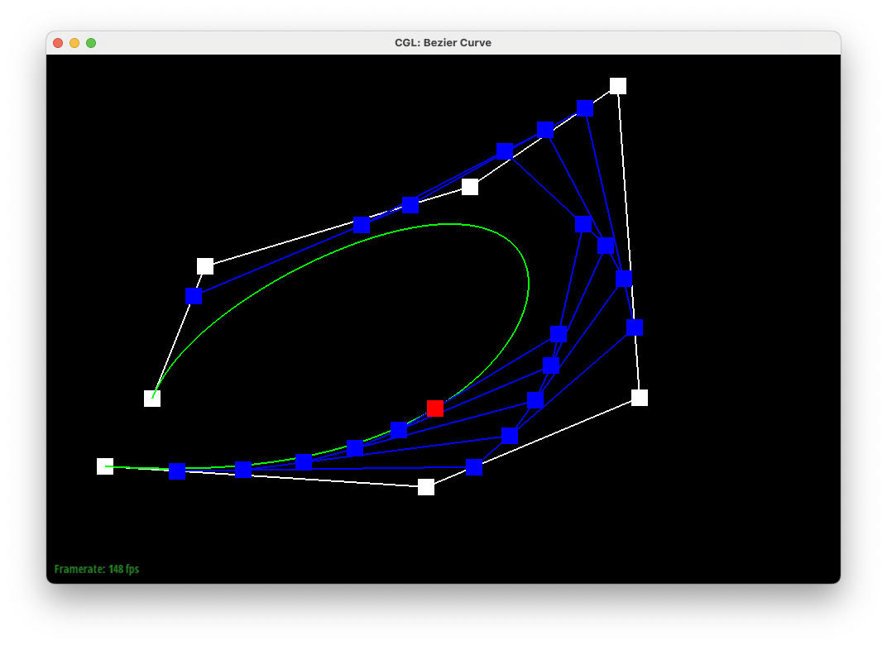
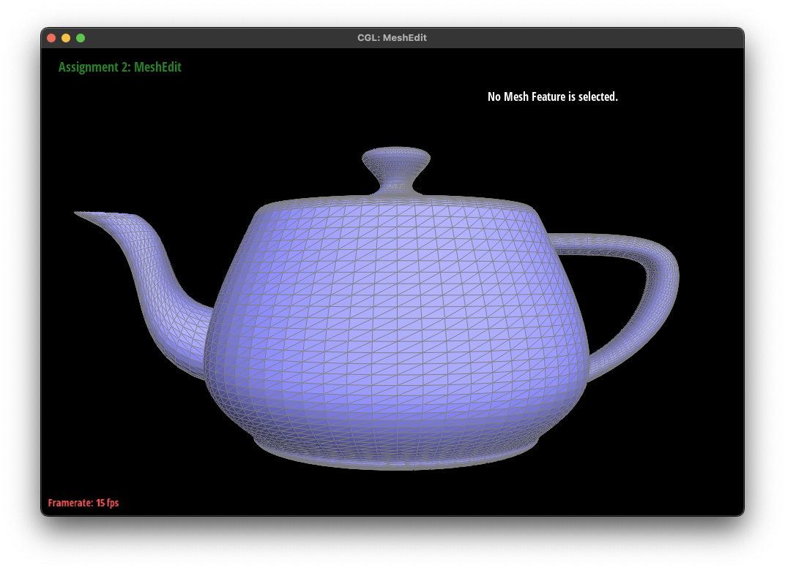
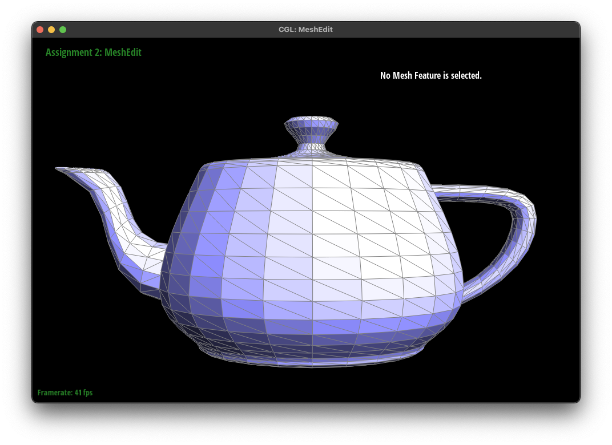
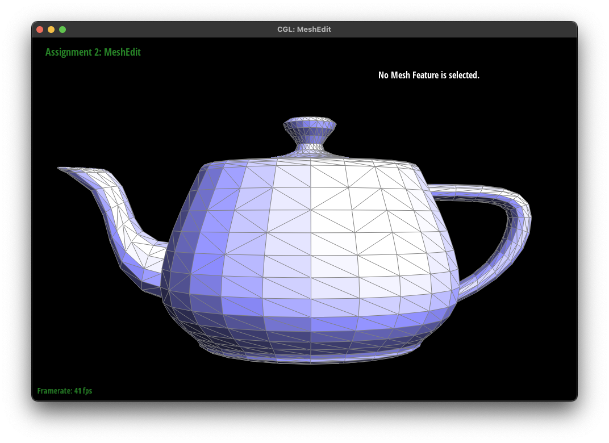
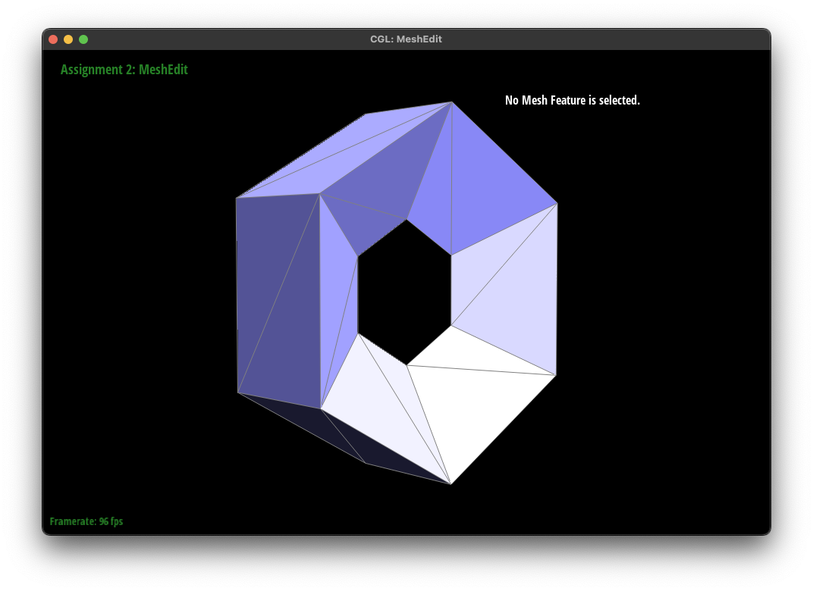
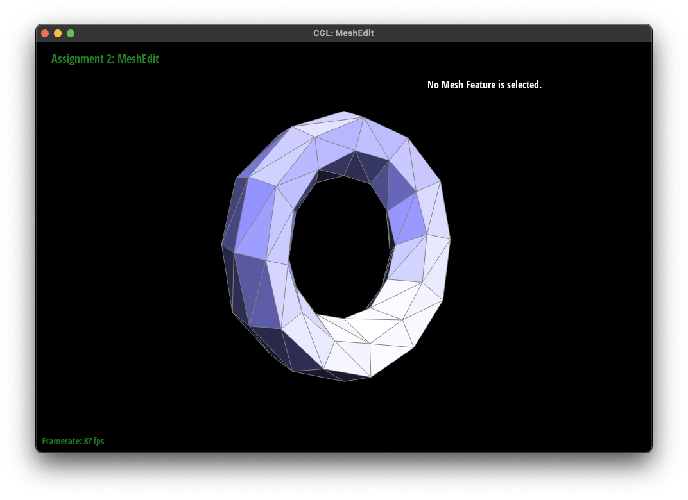
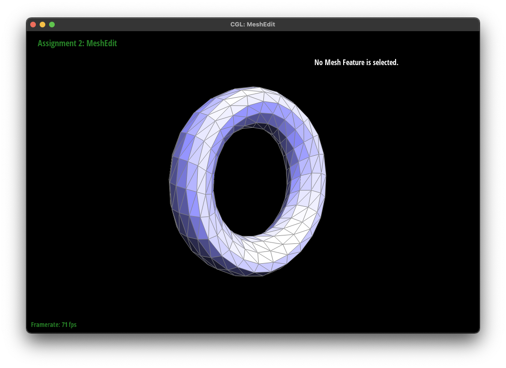
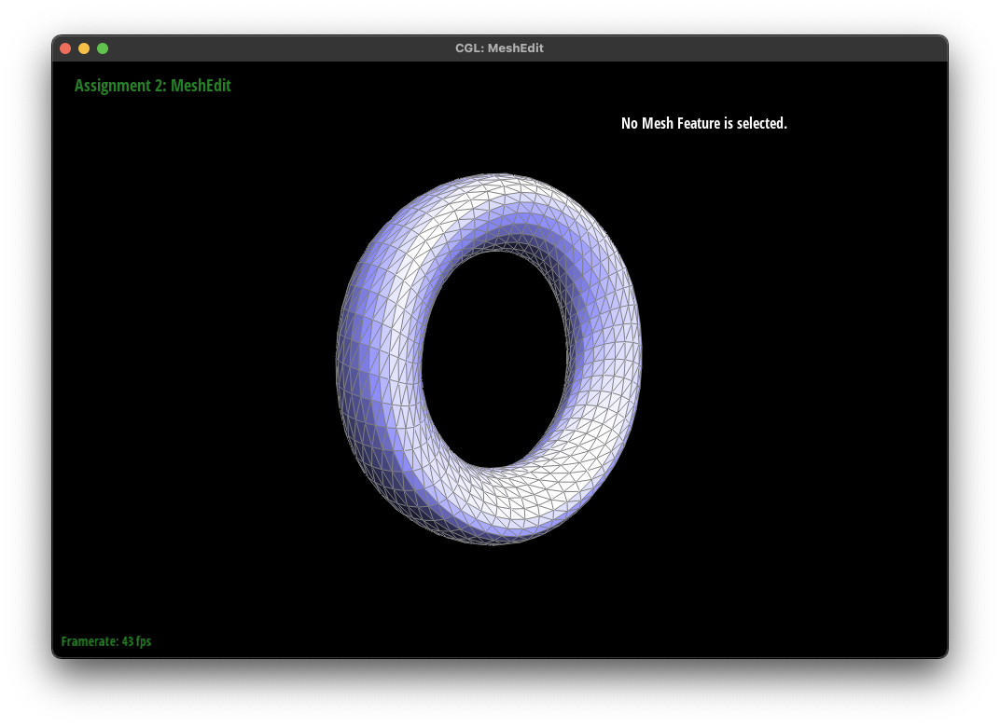
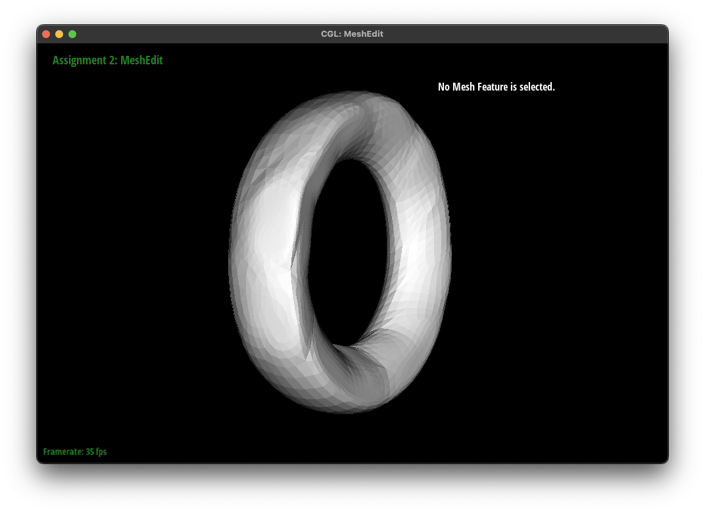
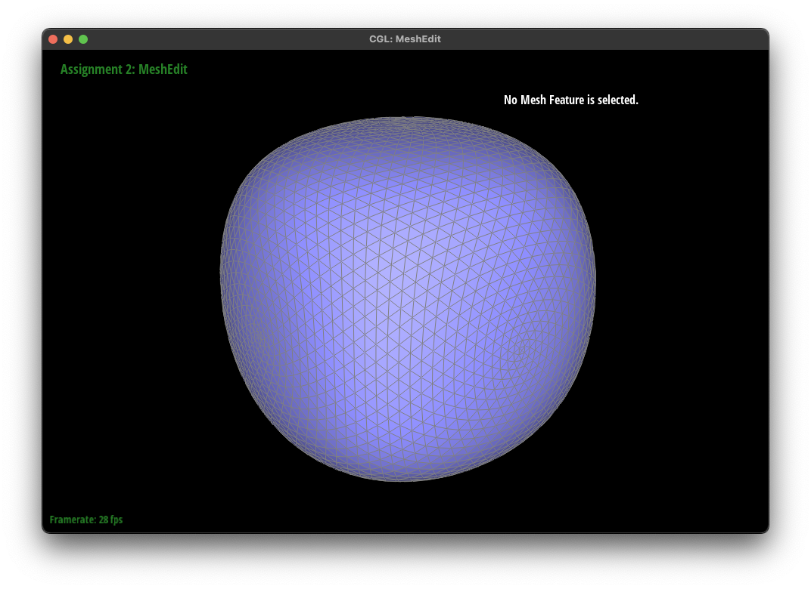

> CS 184/284A: Computer Graphics and Imaging, Spring 2024

> Kian Sutarwala

# Homework 2: Mesh Edit
## Overview

In this assignment I build a mesh viewer/editor which is able to do various operations on different types of meshes, starting from a relatively simple Bezier curve and going all the way up to loop subdivision. I learned a lot about navigating the halfedge data structure, a topic that I didn't concretely understand now since it was a different way of traversing graphs than I was used to. Related to that I also appreciated the importance of visually drawing out diagrams for my own reference when working, as it saved me countless hours of debugging since I was able to easily audit my proposed solutions.

## Section I: Bezier Curves and Surfaces

### Part 1: Bezier Curves with 1D de Casteljau Subdivision

* Briefly explain de Casteljau's algorithm and how you implemented it in order to evaluate Bezier curves.

De Casteljau's algorithm basically takes the weighted average of neighboring points in a string of points and produces a string of points with one less point than the original. This is useful since it allows us to define Bezier curves by recursively repeating the algorithm. I iterated through each of the control points and linearly interpolated it with the next one to calculate the points in next step. I used the parameter t which modifies how much to weigh the next point as opposed to the current one in the calculation. Finally I returned a vector of the new points.

* Take a look at the provided .bzc files and create your own Bezier curve with 6 control points of your choosing. Use this Bezier curve for your screenshots below.
* Show screenshots of each step / level of the evaluation from the original control points down to the final evaluated point. Press E to step through. Toggle C to show the completed Bezier curve as well.
* Show a screenshot of a slightly different Bezier curve by moving the original control points around and modifying the parameter tt via mouse scrolling.

### Part 2: Bezier Surfaces with Separable 1D de Casteljau

* Briefly explain how de Casteljau algorithm extends to Bezier surfaces and how you implemented it in order to evaluate Bezier surfaces.

The algorithm is effectively the same as Bezier curves, you're just doing it in three dimensions as opposed to two. You can linearly interpolate each row of control points first to generate a string of points, and then linearly interpolate that string to get the Bezier surface definition. I used parameter u for the 1D evalution of each row, and then parameter v for the final evaluation of those generated points.

* Show a screenshot of bez/teapot.bez (not .dae) evaluated by your implementation.

##  Section II: Triangle Meshes and Half-Edge Data Structure

### Part 3: Area-Weighted Vertex Normals

* Briefly explain how you implemented the area-weighted vertex normals.

I iterated through all the half edges incident to the vertex so that I could calculate the area of each face (using the magnitude of the cross product of the difference of the points divded by two) and use that to scale its normal before I added it to the sum of normals. I kept going through each halfedge twin pair until I reached the original halfedge again, at which point I normalized the normal sum vector and returned it.

* Show screenshots of dae/teapot.dae (not .bez) comparing teapot shading with and without vertex normals. Use Q to toggle default flat shading and Phong shading.

#### Flat Shading

#### Phong Shading

### Part 4: Edge Flip

* Briefly explain how you implemented the edge flip operation and describe any interesting implementation / debugging tricks you have used.

In my edge flip operation I keep all the exterior halfedges and vertices in their same positions to try to minimize changes, and I effectively rotate the interior edges and halfedges by 90 degrees. As I mention in the debugging section, drawing a diagram so I can visualize what needs to go where made it a lot easier for me to implement and spot bugs. For the exterior half edges, I also made sure that I retained the same face and next pointer as they had before, which I forgot to do initially and was running into really weird visual bugs.

* Show screenshots of the teapot before and after some edge flips.

#### Before Flips

#### After Flips

* Write about your eventful debugging journey, if you have experienced one.

I initially tried to get away with visualizing it in my head and trying to only change the vertices and halfedges that needed to be changed, but it resulted in a ton of weird behavior. So instead I wrote it all down, and used the guide [here](http://15462.courses.cs.cmu.edu/fall2015content/misc/HalfedgeEdgeOpImplementationGuide.pdf) to give me structure on how to name the vertices, halfedges, edges, and faces. I also used this for edge splitting later.

### Part 5: Edge Split

* Briefly explain how you implemented the edge split operation and describe any interesting implementation / debugging tricks you have used.

I did roughly the same thing as last time, drawing a diagram of the before and after and moving around half edges and edges. I found that numbering them helped since I immediately knew which ones were new halfedges, edges, and faces that I had to create since they were a number that didn't exist on the original diagram. I then used `setNeighbors` for each halfedge and used the diagram to fill in the entires. I also reset the halfedge for each vertex, edge, and face, which I realized I had to do after some debugging of missing faces.

* Show screenshots of a mesh before and after some edge splits.

#### Before

#### After

* Show screenshots of a mesh before and after a combination of both edge splits and edge flips.

#### Before

#### After

* Write about your eventful debugging journey, if you have experienced one.

Most of the work was in debugging the edge flips, since I already had the framework down from that it was relatively straightforward to implement edge splits, just had to draw out the diagram and implement it.

### Part 6: Loop Subdivision for Mesh Upsampling

* Briefly explain how you implemented the loop subdivision and describe any interesting implementation / debugging tricks you have used.

I followed the guide provided in the code, so I first started by calculating the new positions for each vertex in the mesh using the formulas provided. I then calculated the new split vertex for each edge using the 3/8 and 1/8 weighting in the spec, making sure to mark each edge as old so it wouldn't break anything later. After, I made a copy of the edges in the mesh before splitting them since I ran into some issues with infinite looping. I then iterated over that copy to split each edge and modified `splitEdge` to set the proper edges to be marked as new. I also moved the split vertex to be in the position that was calculated in the previous step. Lastly, I flipped the edges that connected to a new and old vertex, and moved the vertices to their new positions and reset the `isNew` flag on them. I ran into some weird segfaults when I was manually assigning types to the iterator variables like `EdgeIter`, so I just gave up and used `auto` for everything and the problems went away.

* Take some notes, as well as some screenshots, of your observations on how meshes behave after loop subdivision. What happens to sharp corners and edges? Can you reduce this effect by pre-splitting some edges?

The meshes appear much more curved and rounded, I was really amazed to see how the icosahedron turned into a fully rounded sphere after just a few iterations of loop subdivision. I was able to create a lot of deformed meshes by pre-splitting edges, especially those closer to the boundaries of the mesh. This moderately reduced the rounding effect, but it was definitely still much smoother than the initial model before any loop subdivisions.

#### Step 1

#### Step 2

#### Step 3

#### Step 4

#### Pre-Splitted Edges

* Load dae/cube.dae. Perform several iterations of loop subdivision on the cube. Notice that the cube becomes slightly asymmetric after repeated subdivisions. Can you pre-process the cube with edge flips and splits so that the cube subdivides symmetrically? Document these effects and explain why they occur. Also explain how your pre-processing helps alleviate the effects.

I found that doing edge splits before doing any loop subdivisions had a large impact on making the cube more symmetrical on future subdivisions. Even just splitting each face once made a huge difference. This would make sense since it gives the subdivision algorithm more points and edges early on, which means that one step won't deviate as far. When there's a limited number of points like in the initial cube, then it tries to subdivide each triangle in the mesh which leads to the corners being more pronounced instead of the faces as we'd like it to be. Here's an example of what the cube looks like after pre-processing:

