> CS 184/284A: Computer Graphics and Imaging, Spring 2024

> Kian Sutarwala

# Homework 3: Pathtracer
## Overview

In this homework I made a pathtracer implementation which is able to trace rays around a scene and display accurate lighting using global illumination. I think this was a pretty tough project to debug, especially since the feedback loop is pretty long with the intense renders. But I'm really happy to see the end result and especially compare the vast differences from the scenes that were rendered in part 1 to the ones rendered in part 4/5.

## Part 1: Ray Generation and Scene Intersection

* Walk through the ray generation and primitive intersection parts of the rendering pipeline.

To generate rays, we take the normalized image coordinates, convert them to camera space, and create a new ray starting from the camera position. We limit the ray to `nClip` and `fClip` to ensure that we only care about intersections within the clipping planes.

For each pixel in the scene, we generate `num_samples` rays in the scene, each offset a little using a grid sampler so that we generate different samples. We then can estimate the radiance for the ray using `est_radiance_global_illumination`, which then calculates whether the ray intersects with the scene using the BVH `intersect` method. That method iterates through all primitives in the scene and checks to see if there is an intersection and if so then populates the intersection data of the closest one.

* Explain the triangle intersection algorithm you implemented in your own words.

I used the Möller-Trumbore Algorithm to implement triangle intersection, which is an optimized version of the ray-plane intersection algorithm that also checks to make sure the ray lands inside the triangle. It first calculates the edge vectors for the triangle using the difference of the vertices. Then, it calculates S, S_1, and S_2, which are used in computing the barycentric coordinates of the intersection point inside the triangle. The output of the algorithm is the time of the intersection, and alpha and beta of the barycentric coordinates of the intersect position. After validating that alpha, beta, and the computed gamma are all within the bounds, we can then compute the normal at the intersection and populate the intersection data will all the parameters.

* Show images with normal shading for a few small .dae files.

lucy | dragon
:---:|:---:
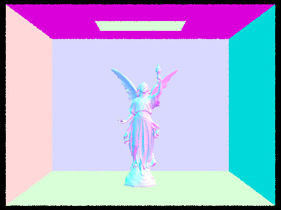 | 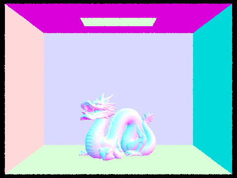

spheres | gems
:---:|:---:
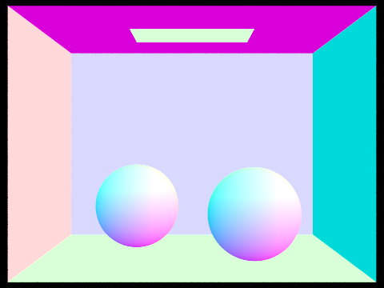 | 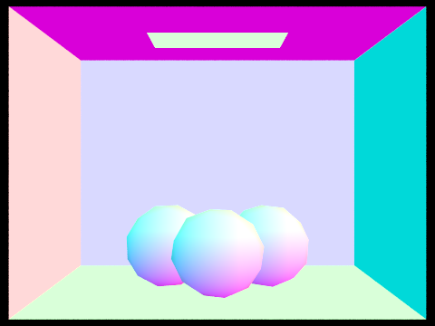

## Part 2: Bounding Volume Hierarchy

* Walk through your BVH construction algorithm. Explain the heuristic you chose for picking the splitting point.

To build the BVH, I started by computing the bounding box of all the primitives in the scene and using that iteration to also count how many primitives there were total to store for later. If all the primitives were able to fit into a leaf node, then I constructed the node and returned it. Otherwise, I calculated the axis to split on by using the extents of the bounding box to find the axis that was the most spread out. I then sorted the list of primitives by their centroid's position on that axis, and placed the first half of the list into the left child and the second half of the list into the right child.

* Show images with normal shading for a few large .dae files that you can only render with BVH acceleration.

wall-e | bench
:---:|:---:
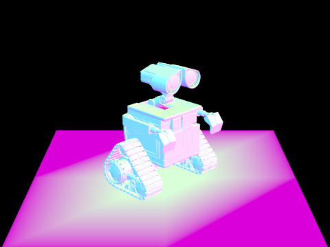 | 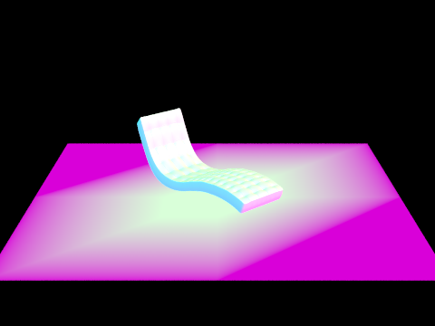

maxplanck | bunny
:---:|:--:
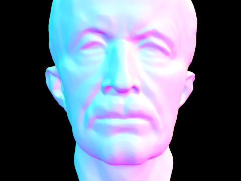 | 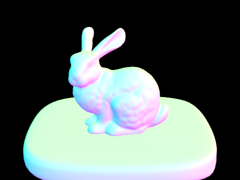

* Compare rendering times on a few scenes with moderately complex geometries with and without BVH acceleration. Present your results in a one-paragraph analysis.

I tested rendering with meshedit/cow, sky/CBlucy, and sky/dragon, running all three renders with 8 threads and a 800x600 resolution. For the cow scene, without BVH acceleration the render took ~15 seconds compared to 0.067 seconds with acceleration. For CBlucy, the differences are much more dramatic: it took ~430 seconds without acceleration and 0.741 seconds after acceleration. It's a similar story for the dragon scene: ~350 seconds without, 0.0786 seconds with acceleration. One thing I noticed is that I'm currently not getting times better than roughly 0.07 seconds. I'm not sure if this because more optimizations are available to be had or whether it's just necessary overhead, but I found it interesting how even incredibly complex scenes with a very large amount of triangles were able to be sped up to take roughly the same time as relatively simple scenes.

<!--
cow:
14.9648s
0.0673s

cblucy:
427.8329s
0.0741s

dragon:
346.5199s
0.0786s
-->

## Part 3: Direct Illumination

* Walk through both implementations of the direct lighting function.

In the hemisphere lighting function, we collect a bunch of samples of incoming light to `hit_p` and then use that to calculate the outgoing light that is reflected to the camera. By using the hemisphere sampler we're able to collect uniform samples around the point, checking if they intersect with a light source, and if so then incorporating the incoming light into our sample.

This is a different approach than the importance sampling function, which only focuses on light sources. If we cast rays from `hit_p` and they reach a light source, then we will incorporate it into our sample since we know it will cast light onto the point. We're able to leverage the same reflectance equation from hemisphere lighting to then return the amount of reflected light back to the camera.

* Show some images rendered with both implementations of the direct lighting function.

### bunny
hemisphere | importance
:---:|:---:
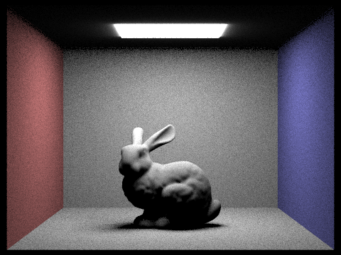 | 

### spheres
hemisphere | importance
:---:|:---:
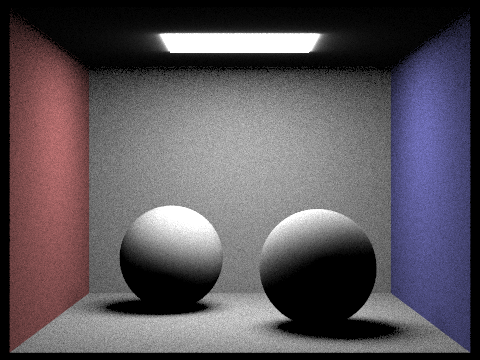 | 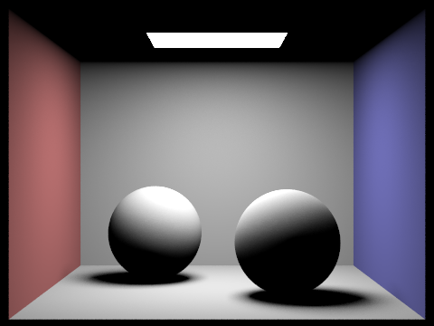

* Focus on one particular scene with at least one area light and compare the noise levels in soft shadows when rendering with 1, 4, 16, and 64 light rays (the `-l` flag) and with 1 sample per pixel (the `-s` flag) using light sampling, not uniform hemisphere sampling.

1 ray | 4 rays
:---:|:---:
 | 

16 rays | 64 rays
:---:|:---:
 | 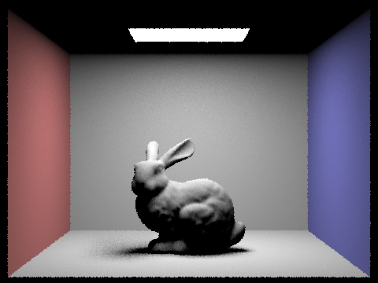

As the number of light rays in the scene increase, the amount of noise decreases and the shadows become smoother. We can observe the benefits of more rays pretty immediately, with a drastic difference between 1 and 4 rays. This makes sense since more rays in the scene mean that we can get a better sense of how the light bounces off the various surfaces in various directions. Additionally, it seems we quickly approach diminishing returns with the number of rays in the scene, as the difference between 16 and 64 is nowhere near as significant as the one between 1 and 4 or 4 and 16 (not to mention the increased render times as well).

* Compare the results between uniform hemisphere sampling and lighting sampling in a one-paragraph analysis.

As can be seen in the images above, there is a lot of noise in uniform hemisphere sampling that's not present in lighting sampling when using the same number of rays and samples per pixel. This is because lighting importance sampling is much more efficient since it only cares about rays that go towards lights as those are the only rays that could possibly have an effect on the light reflected off a point. Using this approach allows us to not waste cycles sampling random directions that wouldn't make any difference on the result and leads to an overall much less noisier output image.

## Part 4: Global Illumination

* Walk through your implementation of the indirect lighting function.

The indirect lighting function calculates the radiance along a ray by calculating all the subsequent bounces the ray will take off its intersection point around the scene. It starts by checking to make sure we haven't exceed the maximum number of bounces, and if we have then we return an empty vector to end the recursion. We then add the one bounce radiance to the output radiance to account for that. If we're using Russian Roulette, we then flip the weighted coin and check if we should terminate the algorithm. If we continue, then we compute the new ray and decrease the depth and recursively calculate the indirect lighting using that ray. We either return the accumulated radiance if `isAccumBounces` is enabled, otherwise we just return the radiance from the final bounce.

* Show some images rendered with global (direct and indirect) illumination. Use 1024 samples per pixel.
<!-- make && ./pathtracer -t 8 -s 1024 -l 16 -m 5 -r 480 360 -f ../docs/images/part4_globalillum_spheres.png ../dae/sky/CBspheres_lambertian.dae  -->
<!-- make && ./pathtracer -t 8 -s 1024 -l 16 -m 5 -r 480 360 -f ../docs/images/part4_globalillum_bunny.png ../dae/sky/CBbunny.dae  -->

spheres | bunny
:---:|:---:
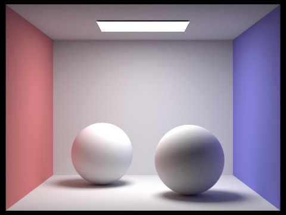 | 

* Pick one scene and compare rendered views first with only direct illumination, then only indirect illumination. Use 1024 samples per pixel. (You will have to edit `PathTracer::at_least_one_bounce_radiance(...)` in your code to generate these views.)
<!-- make && ./pathtracer -t 8 -s 1024 -l 16 -m 5 -r 480 360 -f ../docs/images/part4_walle_direct.png ../dae/sky/wall-e.dae -->
<!-- make && ./pathtracer -t 8 -s 1024 -l 16 -m 5 -r 480 360 -f ../docs/images/part4_walle_indirect.png ../dae/sky/wall-e.dae -->

direct | indirect
:---:|:---:
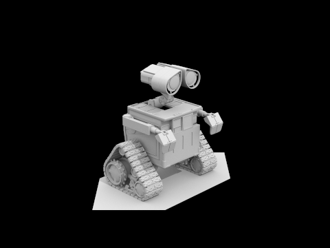 | 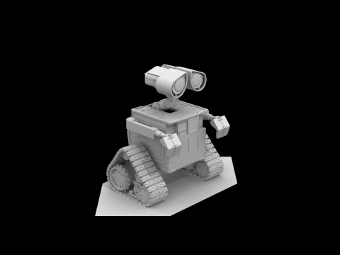

With only indirect illumination, we can see the highlights in the image are dimmer but there are more prominent shadows that are especially visible under wall-e. The direct illumination image has more sharper shadows as well compared to the softer shadows of the indirect illumination.

* For CBbunny.dae, render the mth bounce of light with `max_ray_depth` set to 0, 1, 2, 3, 4, and 5 (the `-m` flag), and `isAccumBounces=false`. Explain in your writeup what you see for the 2nd and 3rd bounce of light, and how it contributes to the quality of the rendered image compared to rasterization. Use 1024 samples per pixel.
<!-- make && ./pathtracer -t 8 -s 1024 -l 16 -m 0 -o 0 -r 480 360 -f ../docs/images/part4_bunny_noaccum_0.png ../dae/sky/CBbunny.dae -->
<!-- make && ./pathtracer -t 8 -s 1024 -l 16 -m 1 -o 0 -r 480 360 -f ../docs/images/part4_bunny_noaccum_1.png ../dae/sky/CBbunny.dae -->
<!-- make && ./pathtracer -t 8 -s 1024 -l 16 -m 2 -o 0 -r 480 360 -f ../docs/images/part4_bunny_noaccum_2.png ../dae/sky/CBbunny.dae -->
<!-- make && ./pathtracer -t 8 -s 1024 -l 16 -m 3 -o 0 -r 480 360 -f ../docs/images/part4_bunny_noaccum_3.png ../dae/sky/CBbunny.dae -->
<!-- make && ./pathtracer -t 8 -s 1024 -l 16 -m 4 -o 0 -r 480 360 -f ../docs/images/part4_bunny_noaccum_4.png ../dae/sky/CBbunny.dae -->
<!-- make && ./pathtracer -t 8 -s 1024 -l 16 -m 5 -o 0 -r 480 360 -f ../docs/images/part4_bunny_noaccum_5.png ../dae/sky/CBbunny.dae -->

depth 0 | depth 1
:---:|:---:
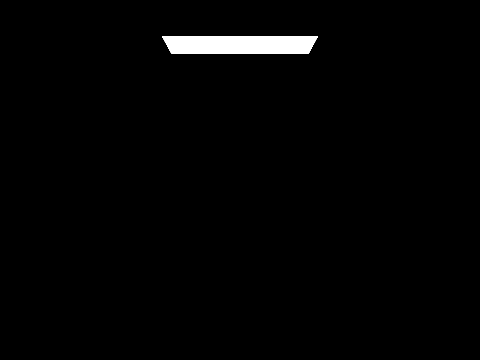 | 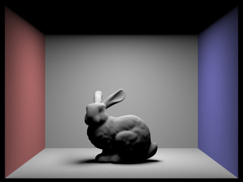

depth 2 | depth 3
:---:|:---:
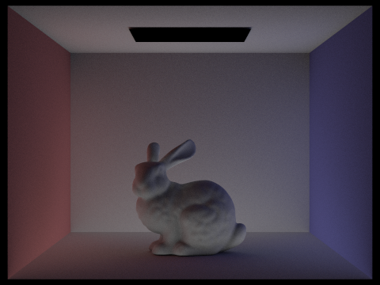 | 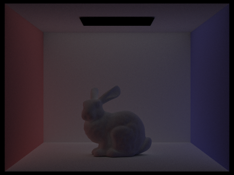

depth 4 | depth 5
:---:|:---:
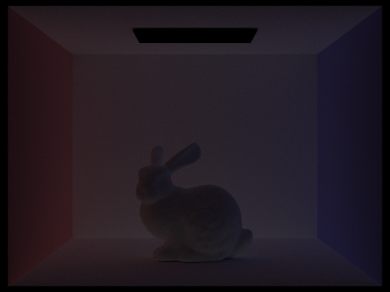 | 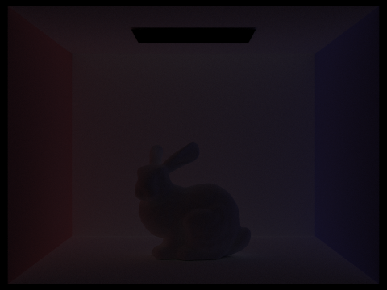

In the second and third bounces of light, it almost appears like the scene has an underglow from the radiance that we chose to display. This makes sense since we're only rendering the light from the final bounce of the rays that we send into the scene, and those areas are the farthest from the light source at the top of the scene. This helps flesh out the illumination from the light bounces in the scene by modelling all the places where light will reach from the light source with respect to the geometry of the scene.

* For CBbunny.dae, compare rendered views with `max_ray_depth` set to 0, 1, 2, 3, 4, and 5 (the `-m` flag). Use 1024 samples per pixel.
<!-- make && ./pathtracer -t 8 -s 1024 -l 16 -m 0 -r 480 360 -f ../docs/images/part4_bunny_accum_0.png ../dae/sky/CBbunny.dae -->
<!-- make && ./pathtracer -t 8 -s 1024 -l 16 -m 1 -r 480 360 -f ../docs/images/part4_bunny_accum_1.png ../dae/sky/CBbunny.dae -->
<!-- make && ./pathtracer -t 8 -s 1024 -l 16 -m 2 -r 480 360 -f ../docs/images/part4_bunny_accum_2.png ../dae/sky/CBbunny.dae -->
<!-- make && ./pathtracer -t 8 -s 1024 -l 16 -m 3 -r 480 360 -f ../docs/images/part4_bunny_accum_3.png ../dae/sky/CBbunny.dae -->
<!-- make && ./pathtracer -t 8 -s 1024 -l 16 -m 4 -r 480 360 -f ../docs/images/part4_bunny_accum_4.png ../dae/sky/CBbunny.dae -->
<!-- make && ./pathtracer -t 8 -s 1024 -l 16 -m 5 -r 480 360 -f ../docs/images/part4_bunny_accum_5.png ../dae/sky/CBbunny.dae -->

depth 0 | depth 1
:---:|:---:
 | 

depth 2 | depth 3
:---:|:---:
 | 

depth 4 | depth 5
:---:|:---:
 | 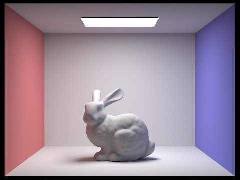

* For CBbunny.dae, output the Russian Roulette rendering with `max_ray_depth` set to 0, 1, 2, 3, 4, and 100 (the `-m` flag). Use 1024 samples per pixel.
<!-- make && ./pathtracer -t 8 -s 1024 -l 16 -m 0 -r 480 360 -f ../docs/images/part4_bunny_roulette_0.png ../dae/sky/CBbunny.dae -->
<!-- make && ./pathtracer -t 8 -s 1024 -l 16 -m 1 -r 480 360 -f ../docs/images/part4_bunny_roulette_1.png ../dae/sky/CBbunny.dae -->
<!-- make && ./pathtracer -t 8 -s 1024 -l 16 -m 2 -r 480 360 -f ../docs/images/part4_bunny_roulette_2.png ../dae/sky/CBbunny.dae -->
<!-- make && ./pathtracer -t 8 -s 1024 -l 16 -m 3 -r 480 360 -f ../docs/images/part4_bunny_roulette_3.png ../dae/sky/CBbunny.dae -->
<!-- make && ./pathtracer -t 8 -s 1024 -l 16 -m 4 -r 480 360 -f ../docs/images/part4_bunny_roulette_4.png ../dae/sky/CBbunny.dae -->
<!-- make && ./pathtracer -t 8 -s 1024 -l 16 -m 100 -r 480 360 -f ../docs/images/part4_bunny_roulette_100.png ../dae/sky/CBbunny.dae -->

depth 0 | depth 1
:---:|:---:
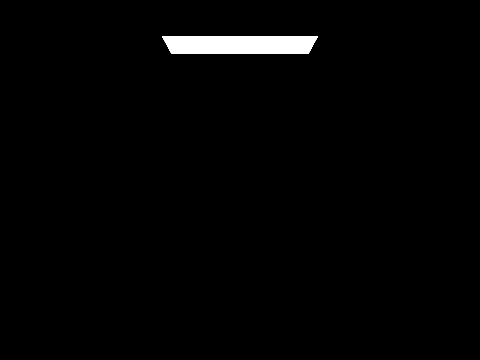 | 

depth 2 | depth 3
:---:|:---:
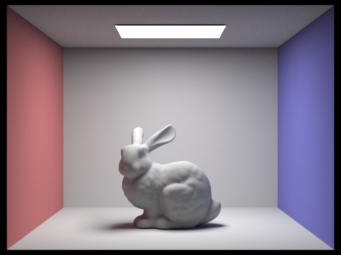 | 

depth 4 | depth 100
:---:|:---:
 | 

* Pick one scene and compare rendered views with various sample-per-pixel rates, including at least 1, 2, 4, 8, 16, 64, and 1024. Use 4 light rays.
<!-- make && ./pathtracer -t 8 -s 1 -l 4 -m 4 -r 480 360 -f ../docs/images/part4_pixelsample_1.png ../dae/sky/dragon.dae -->
<!-- make && ./pathtracer -t 8 -s 2 -l 4 -m 4 -r 480 360 -f ../docs/images/part4_pixelsample_2.png ../dae/sky/dragon.dae -->
<!-- make && ./pathtracer -t 8 -s 4 -l 4 -m 4 -r 480 360 -f ../docs/images/part4_pixelsample_4.png ../dae/sky/dragon.dae -->
<!-- make && ./pathtracer -t 8 -s 8 -l 4 -m 4 -r 480 360 -f ../docs/images/part4_pixelsample_8.png ../dae/sky/dragon.dae -->
<!-- make && ./pathtracer -t 8 -s 16 -l 4 -m 4 -r 480 360 -f ../docs/images/part4_pixelsample_16.png ../dae/sky/dragon.dae -->
<!-- make && ./pathtracer -t 8 -s 64 -l 4 -m 4 -r 480 360 -f ../docs/images/part4_pixelsample_64.png ../dae/sky/dragon.dae -->
<!-- make && ./pathtracer -t 8 -s 1024 -l 4 -m 4 -r 480 360 -f ../docs/images/part4_pixelsample_1024.png ../dae/sky/dragon.dae -->

1 sample | 2 samples
:---:|:---:
 | 

4 samples | 8 samples
:---:|:---:
 | 

16 samples | 64 samples
:---:|:---:
 | 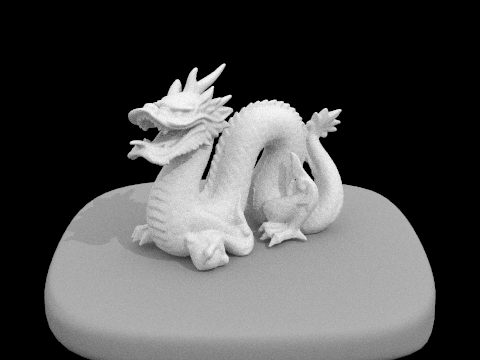

1024 samples |
:---:|
 |

I chose the dragon scene, and as we can see with a low sample rate there is a lot of noise in the image. And even as we get to larger sample rates a lot of the noise has diminished compared to before but it's still visible. It's not until we get 1024 samples that most of the coarse noise has disappeared and we get a smooth image.

## Part 5: Adaptive Sampling

* Explain adaptive sampling. Walk through your implementation of the adaptive sampling.

Adaptive sampling allows us to speed up renders by sampling less for pixels that converge quickl, proving more time to spend on pixels that converge slower. We'll terminate tracing rays for a pixel when either the samples generated at that pixel are all very close to each other (meaning they converged) or we've exhausted the number of samples we want to spend on an individual pixel. My adaptive sampling implementation is relatively straightforward, I keep a running tally of the illuminance of each sample and use that to calculate the mean and variance when checking for convergence. To make it efficient, I only check for convergence every `samplesPerBatch` samples. If it does converge, then I update `numSamples` to reflect the final amount of samples taken and stop sampling.

* Pick two scenes and render them with at least 2048 samples per pixel. Show a good sampling rate image with clearly visible differences in sampling rate over various regions and pixels. Include both your sample rate image, which shows your how your adaptive sampling changes depending on which part of the image you are rendering, and your noise-free rendered result. Use 1 sample per light and at least 5 for max ray depth.
<!-- ./pathtracer -t 8 -s 2048 -a 64 0.05 -l 1 -m 5 -r 480 360 -f ../docs/images/part5_bunny.png ../dae/sky/CBbunny.dae -->
<!-- ./pathtracer -t 8 -s 2048 -a 64 0.05 -l 1 -m 5 -r 480 360 -f ../docs/images/part5_walle.png ../dae/sky/wall-e.dae -->

bunny | bunny rate
:---:|:---:
 | 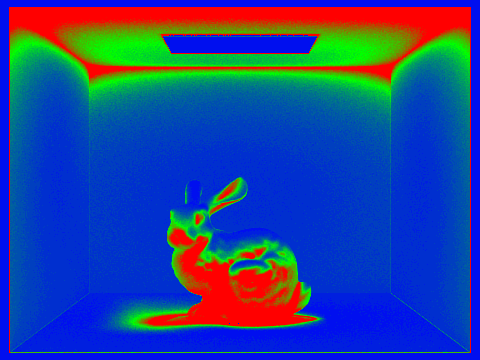

wall-e | wall-e rate
:---:|:---:
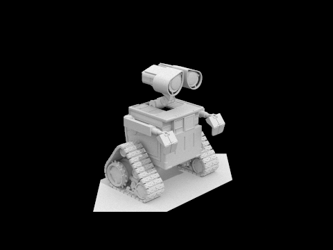 | 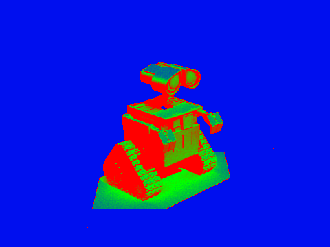
